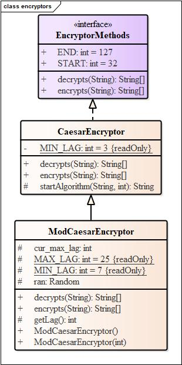
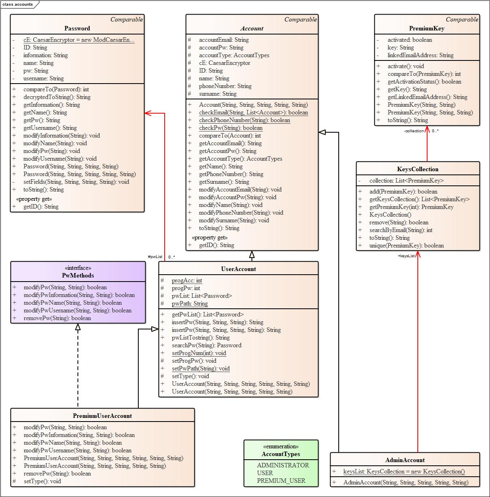
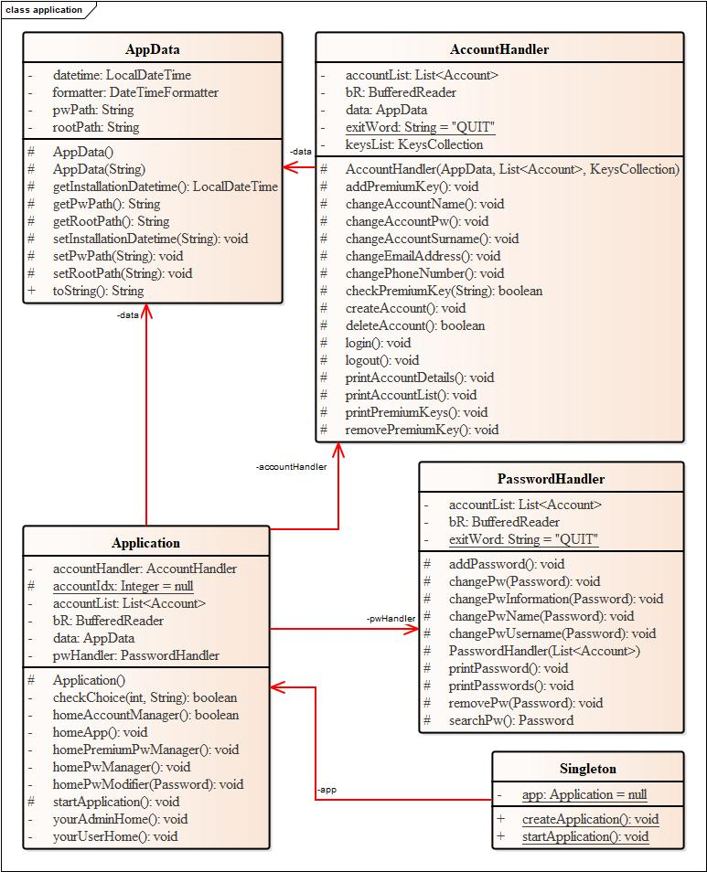
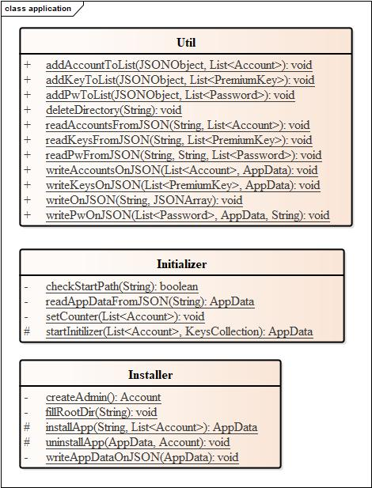

# PasswordCollector, a Java application to manage locally our passwords

## Author ##
+ **Lorenzo LEONI**, postgraduate in Computer Engineering at University of Bergamo.

## Description ##
Many times we have to write our passwords on a paper sheet because we are distrustful toward the online storage services, which rely on servers that frequently fall victim to hacker attacks. *PasswordCollector* tries to avoid this problem by providing a **management**, **storage** and **encryption** service of our passwords without Internet connection. In particular:
+ the storage of personal data takes place with JSON documents, an interchange format which makes easy the portability not only of information content, but also of the application as a result;
+ the encryption of sensitive data takes place with a modified version of the Caesar cipher. It is based on a random shift in ASCII table of each character that makes up the password to encrypt;
+ the interaction with *PasswordCollector* is via a command line interface.

To underline, finally, the opportunity to register multiple accounts such that the same instance of the application can be used by more users without one being able to access the sensitive contents of the other.

## Installation
1. Download the latest release.
2. Open the Command Prompt in which you have save the runnable JAR file.
3. Execute the following command:
``` java
jar -jar Pw_C0ll3ct0r.jar
```
4. Choose the directory in which you want to install PasswordCollector.
5. Follow the instructions to create the administrator account.

## UML Class Diagrams ##
- [x] UML Class Diagram of the package *encryptors*.



- [x] UML Class Diagram of the package *accounts*.



- [x] UML Class Diagram of the package *application*, part 1.



- [x] UML Class Diagram of the package *application*, part 2.




